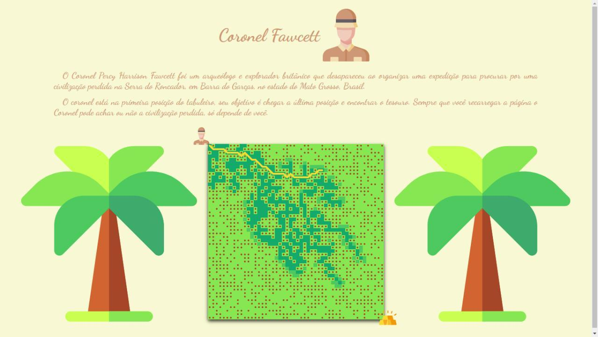
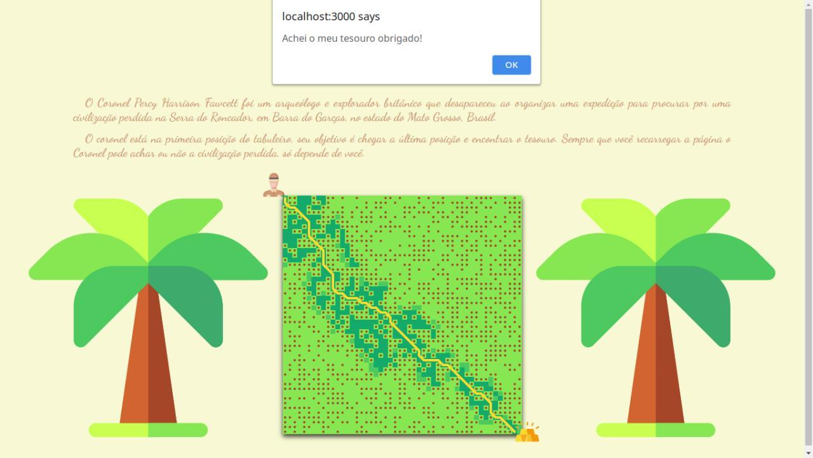
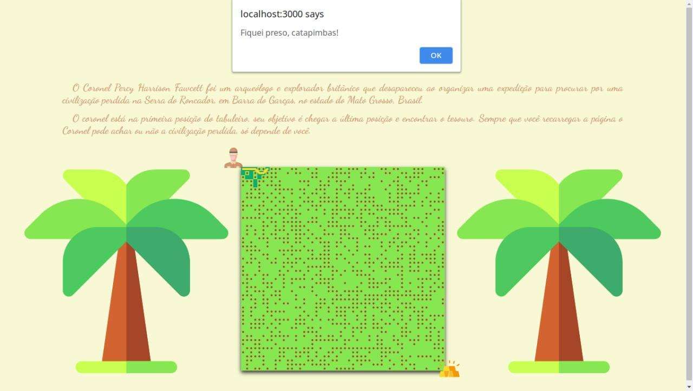

# Fawcett

**Número da Lista**: 2<br>
**Conteúdo da Disciplina**: Grafos 2<br>

## Alunos
|Matrícula | Aluno |
| -- | -- |
| 17/0062686 |  Pedro Rodrigues Pereira |
| 17/0008371 |  Daniel de Sousa Oliveira Melo Veras |

## Sobre 
O Coronel Percy Harrison Fawcett foi um arqueólogo e explorador britânico que desapareceu ao organizar uma expedição para procurar por uma civilização perdida na Serra do Roncador, em Barra do Garças, no estado do Mato Grosso, Brasil.

Ele se encontra na primeira posição do tabuleiro, seu objetivo é chegar a última posição e encontrar o tesouro. Sempre que você recarregar a página o Coronel pode achar ou não a civilização perdida, só depende de você.

## Screenshots

### Em busca do ouro



### Fim da aventura



### Preso na selva




## Instalação 
**Linguagem**: Javascript<br>
**Framework**: p5.js<br>
<br>
Para fazer uso do projeto se faz necessário possuir o Docker e Docker-compose.

1. Primeiro passo é realizar o download do repositório com o seguinte comando:

```
$ git clone https://github.com/projeto-de-algoritmos/Grafos2_Fawcett.git
```


2. Após o download, acesse a pasta base do projeto:

```
$ cd Grafos2_Fawcett
```

3. Agora basta rodar o seguinte comando do docker

```
$ docker-compose up --build
```

## Uso 
Após a execução do container docker, se faz necessário abrir seu navegador de preferência e acessar o link:

**http://localhost:3000/**

A partir desse ponto, o aplicativo já começa a rodar automaticamente. Gerando um resultado diferente cada vez que a página é atualizada.
